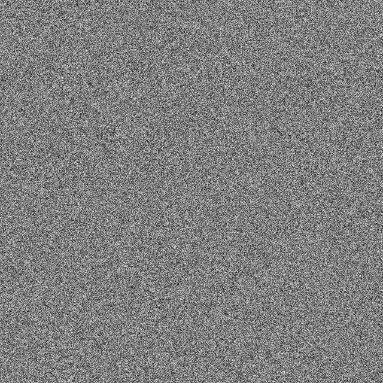
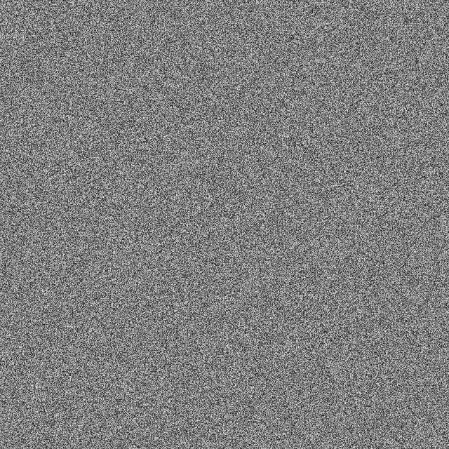
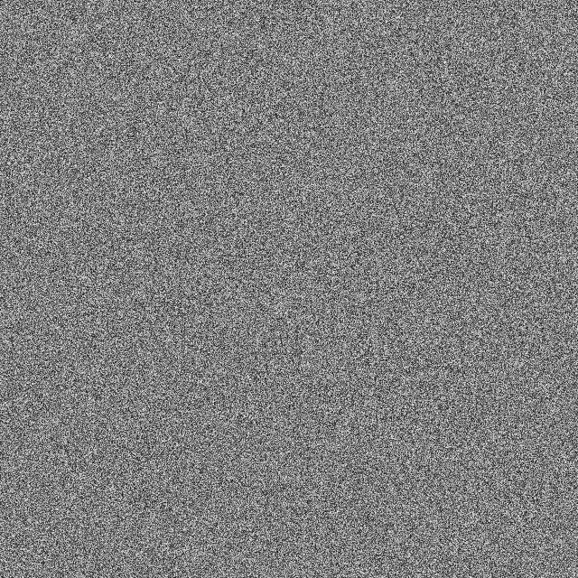
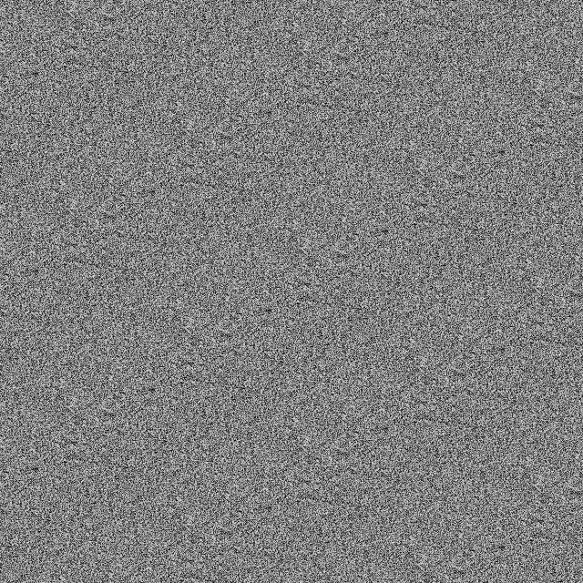
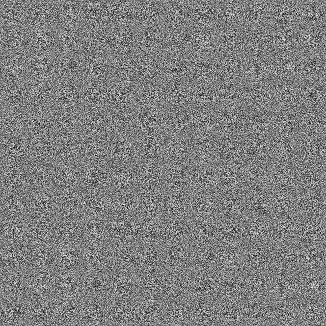

# PRNG Image Generator
This is a simple pseudo random number generator tester using bitmap image pixels. It can be used to test true randomness of any pseudo random number generator. Good RNGs will produce an image like white noise, while bad output will result with discernible patterns.
## Configuration
In the `rng_image_tester.c`, single bitmap file output settings can be configured with preprocessor macros the follows:
```c
#define GRAYSCALE // Exclude for full RGB
#define WIDTH  1000
#define HEIGHT 1000
#define FILENAME 32bit.bmp
```
Pick one pseudo random generator function with the RNG macro:
```c
// RNG function selection, pick one
#define RND pcg32();
//#define RND xshft8();
//#define RND xshft16();
//#define RND tzarc_prng();

```
To test any pseudo random number generator function, add them above `main()` function, and link it to the macro `RND`.
## Multi RNG
The `multi_rng_image.c` file uses pointer function to generate multiple images for all PRNG tests. The use of pointers however requires all RNG return value to be a consistent 64-bit type cast. Sample images below are under 1000x1000 pixels. Using this code to generate images larger than 1500x1500 pixel will produce sufficiently large samples that may reveal repeated patterns for poor pseudorandom generators.
```c
#define WIDTH  1500
#define HEIGHT 1500
```
# Image samples
## PCG-XSH-RR


The Permuted congruential generator `pcg32()` is the largest pseudorandom code base and it produces a nice noisy random image that is a good reference. Compiled size will be larger than C library's own `rand()`, making it unsuitable for embedded systems. See `pcg32_fast()` and `pcg32_minimal()` for different variants.

## George Marsaglia's XORshift
### Xorshift128


George Marsaglia is the mathematician that discovered shift-register generators, and these codes are the base XORshift reference for many variants (`xorshift32()`, `xorshift64()` and `xorshift128()`). They are fairly quick but compiled sizes are not as compact due to its large register sizes. (Shift, rotate based variants, `xoshiro` and `xoroshiro` are included in source files)

## Forschinger's 16-bit XORshift


Brad Forschinger's version of 16-bit `rnd_xorshift_16()` is efficient for its diminutive algorithm. Its small compiled size is suitable for embedded systems.

## 8-bit XORshift
### Tzarc's PRNG

### 4-register 8-bit XORshift


On the lowest end, 8-bit codes shows limitation of linear-feedback shift register PRNGs. Samples from Tzarc's `tzarc_prng()` eventually repeat themselves with discernible patterns due to single register. We mitigate by using four 8-bit-register PRNG with `xshift8()` to avoid repetition. However empirical tests that follows reveals the limitation of 8-bit shift registers.

# Empirical tests
## TestU01
Tests using [TestU01](http://simul.iro.umontreal.ca/testu01/tu01.html) are recorded in [the testu01-results.txt file](testu01-results.txt):
* Unsurprising, the 8-bit PRNGs failed almost all of them.
* Both PCGs algorithm failed most tests except `pcg32_fast`.
* George Marsaglia's XORshift codes stood up well; its `xoshiro` and `xoroshiro` rotating variants passed everything.
* Brad Forschinger's `rnd_xorshift_16()` is the winner with the an efficient algorithm that failed just one test.

# Footnote
Be aware that all these samples are pseudorandom number generators, not true RNGs. They should not be applied on sensitive cryptographic use-cases.

# External links
* [Visualizing the Heart of Some PRNGs](https://www.pcg-random.org/posts/visualizing-the-heart-of-some-prngs.html)
* [Permuted congruential generator](https://en.wikipedia.org/wiki/Permuted_congruential_generator)
* [Xorshift](https://en.wikipedia.org/wiki/Xorshift)
* [Brad Forschinger 16 bit xorshift rng](http://b2d-f9r.blogspot.com/2010/08/16-bit-xorshift-rng-now-with-more.html)
* [PractRand](http://pracrand.sourceforge.net/)
* [How to Test with PractRand](https://www.pcg-random.org/posts/how-to-test-with-practrand.html)
* [TestU01](http://simul.iro.umontreal.ca/testu01/tu01.html)
* [How to Test with TestU01](https://www.pcg-random.org/posts/how-to-test-with-testu01.html)
